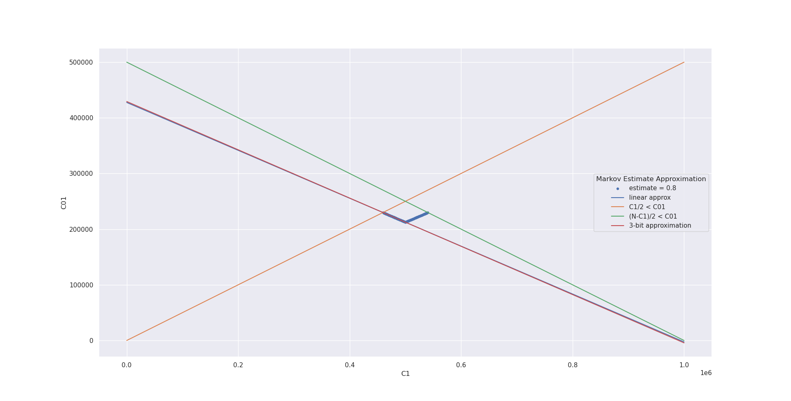

# Cryptography on Hardware Platforms - TRNG

### Summary

We implemented a TRNG for the Xilinx Pynq-z2 FPGA board using ring oscillators. We also implemented a module to perform a Markov Estimate test in hardware that can issue an error if the estimated entropy of our RNG is below `0.8`.

### Task 1

We use 191 ring oscillators with 3 NOT-gates, capture the output of each of them in registers and XOR them combinatorically in the next clock cycle.
We arrived at this number by experimental testing. (While we probably could have used a lot less, Xilinx tools made it almost impossible to have reliable results as sometimes it silently refused to import the new bitstream file into the SDK project. We therefore chose a number with reliably reaches an estimated entropy of at least `0.8` in all statistical tests)

### Task 2

Our implementation strategy for task 2 involves linearly approximating the Markov Estimate.
First we can determine C1 and C01 via a simple state machine that processes the random bits as a stream, saving the last processed bit in a register to determine C01. We process data word by word, calculating

```
C1 += Hamming-weight(word) 
C01 += Hamming-weight(~((word << 1) | (last_word & 1)) 
```

We apply this for every word in the 1M bit input sequence to arrive at the final number for C1 and C01.

The second step in our statistical test is to determine if the estimated entropy is below or above `0.8`. 
To visualize our approximation relations, we drew a graph which shows our solution compared with the points where the estimated entropy is `0.8`. The other two lines mark implicit conditions which are true for every sequence of bits.



We perform some linear preprocessing, exploiting the symmetry of the problem (input sequences with inverted 1s and 0s have an identical entropy estimate):

v1 = min(C1, N-C1)
v2 = C01

Now we use the results of our linear regression experiments (implemented in Python+Excel) to determine if the min-entropy is > 0.8 by checking either of two inequalities:

```
v2 > -0.43012323324485 * v1 + 427560.736794103 (we use this)
v1 > -2.32491484969302 * v2 + 994042.352587566 (alternative)
```

To avoid the use of floating point arithmetic in hardware, we instead opt to approximate the factor by evaluating the following expression (obtained by converting the float to Canonical Signed-Digit representation and cutting off the lower bits):

```
v2 > 427561 - (v1 >> 1) + (v1 >> 4) + (v1 >> 8)
```

as `- (v1 >> 1) + (v1 >> 4) + (v1 >> 8) = -0.43359375 * v1`.

To make sure our check is still stricter than the true Markov Estimate, we adjust the constant factor to be equivalent in the case of C1 = N/2.

```
v1 = 500000
v2 = -0.43012323324485 * v1 + 427560.736794103 = 212499.120171678
v2 = -0.43359375 * v1 + const  ->  const = v2 + 0.43359375 * v1 = 429295.995171678
```

We derive at our final check:
```
v2 > 429296 - (v1 >> 1) + (v1 >> 4) + (v1 >> 8)
```

Since we chose a steeper slope for our discriminating inequality, our resulting test is slightly biased towards sequences with an unbalanced number of ones and zeros. We could get more exact results if we used more bits in our inequality. However, we experimentally try to estimate our maximum delta to the true Makrov entropy estimate to be approximately `0.000656`, which indicates that we could have used a less exact estimate as well.

